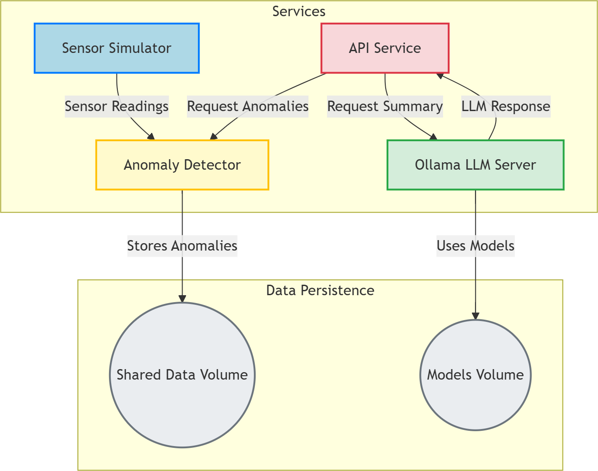

# AquaSense-Monitor: Smart Water Quality Anomaly Detection and Summarization

AquaSense-Monitor is a microservices-based system designed to simulate, detect, and summarize anomalies in water quality sensor data. It leverages FastAPI for robust APIs, Docker for containerization, and Ollama with LangChain for AI-powered summarization of detected anomalies.

## Table of Contents

1. [System Overview](#1-system-overview)
2. [Software Architecture Diagram](#2-software-architecture-diagram)
3. [Setup Instructions](#3-setup-instructions)
4. [Explanation of Detection Thresholds](#4-explanation-of-detection-thresholds)
5. [LangChain and LLM Integration](#5-langchain-and-llm-integration)
6. [API Documentation](#6-api-documentation)
7. [Local Deployment Instructions](#7-local-deployment-instructions)
8. [Notes on System Observability and Security](#8-notes-on-system-observability-and-security)

-----

## 1\. System Overview

The AquaSense-Monitor system comprises several interconnected services orchestrated by Docker Compose:

### I. Services

* **Sensor Simulator:**
    * **Role:** This service acts as the data source, generating synthetic sensor readings for water quality parameters such as temperature, pressure, and flow. It's crucial for testing and demonstrating the system without requiring physical sensors.
    * **Anomaly Injection:** A key feature is its ability to periodically inject various types of anomalies (e.g., sudden "spikes" in readings, gradual "drifts" over time, or "dropouts" where data transmission is intentionally skipped) based on predefined thresholds in `common/config.py`. This ensures comprehensive testing of the anomaly detection capabilities.
    * **Interface:** It runs its own FastAPI server and exposes a `/status` endpoint, allowing other services (like the API Service) to verify its operational health.
    * **Communication:** Pushes `SensorReading` data (JSON payload) via HTTP POST requests to the Anomaly Detector's `/data` endpoint.

* **Anomaly Detector:**
    * **Role:** This is the primary processing unit for incoming sensor data. It receives the continuous stream of readings from the Sensor Simulator.
    * **Detection Logic:** While the specific anomaly detection algorithms are abstracted, its core function is to apply predefined rules and thresholds (from `common/config.py`) to identify deviations from normal operating parameters.
    * **Anomaly Storage:** Upon detecting an anomaly, it stores the `Anomaly` details (timestamp, type, sensor ID, parameter, value, message) for historical record. This data is persisted in `anomalies.json` within the shared `data` Docker volume.
    * **Interface:** It also operates a FastAPI server, exposing an `/anomalies` endpoint that allows other services to retrieve the most up-to-date list of detected anomalies. Its `/status` endpoint (or `/anomalies` itself) serves for health checks.

* **Ollama LLM Server:**
    * **Role:** This service is the intelligent backend for natural language processing. It hosts and serves Large Language Models (LLMs), specifically the `mistral` model, which is used for generating human-readable summaries.
    * **Model Management:** Orchestrated by Docker Compose, it automatically pulls the `mistral` model upon startup, ensuring the necessary AI capabilities are available. Models are persisted across container restarts using a dedicated `models` Docker volume.
    * **Interface:** It exposes its standard Ollama API port (11434), allowing client libraries (like LangChain) to send inference requests and receive model responses.

* **API Service:**
    * **Role:** This is the central public-facing gateway of the entire AquaSense-Monitor system. It consolidates functionalities and provides a unified interface for external applications or users.
    * **Anomaly Retrieval:** It directly fetches the latest anomalies from the Anomaly Detector via its `/anomalies` endpoint when requested by its own `/anomalies` endpoint or when preparing data for summarization.
    * **Integrated LLM Summarizer:** It incorporates the `LLMSummarizer` class (built with LangChain) internally. This class handles the communication with the Ollama server, crafting prompts from anomaly data and parsing the LLM's natural language responses.
    * **On-Demand Summarization:** It offers a `/summary` endpoint where users can request a summary of anomalies. This is based on the most recent anomalies fetched from the Anomaly Detector. The generated summary is returned directly to the client.
    * **Comprehensive Health Status:** A critical aspect is its `/status` endpoint, which provides a holistic health overview of the entire system. It actively pings the `/status` or relevant endpoints of the Sensor Simulator, Anomaly Detector, and Ollama (including checks for model loading) to determine their real-time operational status.
    * **Interface:** It runs a FastAPI server, exposing all public API endpoints and interactive Swagger UI documentation (`/docs`).

### II. Key Interactions and Data Flow:

1.  **Sensor Data Stream:** The `Sensor Simulator` continuously pushes simulated `SensorReading` data to the `Anomaly Detector`.
2.  **Anomaly Data Access:** The `API Service` pulls the latest `Anomaly` data from the `Anomaly Detector` as needed.
3.  **LLM Inference:** The `API Service` (specifically, its integrated `LLMSummarizer`) sends requests containing anomaly details to the `Ollama LLM Server` for summarization, receiving a concise text summary in return.
4.  **System Health Monitoring:** The `API Service` periodically queries the health endpoints of the `Sensor Simulator`, `Anomaly Detector`, and `Ollama LLM Server` to compile a comprehensive system health report.
5.  **Shared Persistence:** The `data` Docker volume facilitates persistent storage of `anomalies.json` (written by Anomaly Detector). The `models` volume ensures Ollama's LLM models are retained.

### III. Architectural Advantages:

This microservices approach, orchestrated by **Docker Compose**, provides several benefits:
* **Modularity:** Each service is self-contained, making development, testing, and maintenance simpler.
* **Scalability:** Individual services can be scaled independently based on their load requirements.
* **Resilience:** The failure of one service is less likely to bring down the entire system. Health checks and dependencies help manage service readiness.
* **Technology Diversity:** While currently all Python, this architecture allows different services to use different technologies if needed.
* **Clear APIs:** Well-defined HTTP APIs facilitate communication and integration between services.

## 2\. Software Architecture Diagram

Below is the architecture diagram showing the interactions between services:



## 3\. Setup Instructions

Before you begin, ensure you have the following installed:

  * **Docker Desktop:** Includes Docker Engine and Docker Compose.
      * [Download Docker Desktop](https://www.docker.com/products/docker-desktop/)

**Steps:**

1.  **Clone the Repository:**

    ```bash
    git clone https://github.com/The-Vheed/AquaSense-Monitor/
    cd aqua-sense-monitor # Or the root directory of your project
    ```

2.  **Ensure `models` Directory Exists:**
    The `ollama` service uses a Docker volume to persist models. Create this directory if it doesn't exist:

    ```bash
    mkdir -p models
    ```

3.  **Build and Start Services:**
    Navigate to the root directory of the project (where `docker-compose.yml` is located) and run:

    ```bash
    docker compose up --build -d
    ```

      * `--build`: This flag ensures that Docker builds the images for your custom services (Anomaly Detector, Sensor Simulator, API Service) from their respective Dockerfiles.
      * `-d`: Runs the containers in detached mode (in the background).

    **Note:** The first time you run this, Ollama will automatically download the `mistral` LLM, which can take a significant amount of time depending on your internet connection (the model is several gigabytes). You will see output from the `ollama` container indicating the download progress.

4.  **Verify Services are Running:**
    You can check the status of your running containers:

    ```bash
    docker compose ps
    ```

    All services should show `Up (healthy)` or `Up` (for services without explicit health checks).

## 4\. Explanation of Detection Thresholds

The anomaly detection in this system is primarily rule-based, defined by thresholds configured in `common/config.py`. The `Sensor Simulator` also uses these thresholds to inject specific anomaly types for testing.

  * **`Config.TEMP_NORMAL_MIN` / `Config.TEMP_NORMAL_MAX`**: Normal operating range for temperature.
  * **`Config.PRESSURE_NORMAL_MIN` / `Config.PRESSURE_NORMAL_MAX`**: Normal operating range for pressure.
  * **`Config.FLOW_NORMAL_MIN` / `Config.FLOW_NORMAL_MAX`**: Normal operating range for flow.
  * **`Config.TEMP_SPIKE_THRESHOLD_HIGH` / `LOW`**: Thresholds for sudden, sharp deviations in temperature.
  * **`Config.PRESSURE_SPIKE_THRESHOLD_HIGH` / `LOW`**: Thresholds for sudden, sharp deviations in pressure.
  * **`Config.FLOW_SPIKE_THRESHOLD_HIGH` / `LOW`**: Thresholds for sudden, sharp deviations in flow.
  * **`Config.DRIFT_CONSECUTIVE_READINGS`**: Number of consecutive readings exceeding a threshold to be considered a "drift" anomaly (sustained deviation).
  * **`Config.DROPOUT_THRESHOLD_SECONDS`**: Time duration after which a lack of readings is considered a "dropout" anomaly.

These thresholds are used by the `Anomaly Detector` to classify incoming sensor data as normal or anomalous. The `Sensor Simulator` uses these values to generate data that deliberately triggers these anomaly conditions, facilitating testing and demonstration.

## 5\. LangChain and LLM Integration

The system integrates a Large Language Model (LLM) for summarizing detected anomalies, making the insights more human-readable and actionable.

  * **LLM Provider:** [Ollama](https://ollama.ai/) is used as the local LLM server, hosting the `mistral` model.
  * **Framework:** [LangChain](https://www.langchain.com/) is employed within the `LLMSummarizer` class to interact with Ollama. LangChain simplifies the process of building LLM-powered applications by providing abstractions for prompts, chains, and model interactions.
  * **`LLMSummarizer` Class:**
      * Located in `llm_summarizer/summarizer.py`.
      * Initializes a `ChatOllama` client and a `PromptTemplate`.
      * The `PromptTemplate` is designed to instruct the LLM to analyze a list of anomalies and provide a concise summary, focusing on important events and their impact.
      * The `generate_summary` method takes a list of `Anomaly` objects, formats them into a string, and sends them to the LLM via a LangChain `LLMChain` for summarization.
  * **Integration in API Service:**
      * An instance of `LLMSummarizer` is initialized globally within `api_service/app.py`.
      * The `/summarize` endpoint in the `API Service` directly calls this `LLMSummarizer` instance to generate summaries on demand, either for provided anomalies or for the latest anomalies fetched from the `Anomaly Detector`.
      * The `/status` endpoint also uses `LLMSummarizer` to perform a health check by attempting to summarize an empty list of anomalies.

This integration allows the system to not only detect anomalies but also to provide intelligent, contextual summaries, enhancing the system's utility for monitoring water quality.

## 6\. API Documentation

The `API Service` exposes several endpoints for interacting with the system. Once the services are up and running, you can access the interactive API docs provided by the FastAPI server.

  * **API Service Base URL:** `http://localhost:8000`
  * **API Service Docs URL:** `http://localhost:8000/docs`

### Endpoints:

* **Get Recent Anomalies:**
    * **Method:** `GET`
    * **URL:** `http://localhost:8000/anomalies`
    * **Request Format:**
        * No request body.
        * Query Parameters: None.
    * **Response Format (Status Code: 200 OK):**
        ```json
        [
            {
                "type": "spike",
                "timestamp": "2025-05-28T15:30:00Z",
                "sensor_id": "sensor_001",
                "parameter": "temperature",
                "value": 35.5,
                "duration_seconds": null,
                "message": "Temperature spiked unexpectedly."
            },
            {
                "type": "drift",
                "timestamp": "2025-05-28T15:20:00Z",
                "sensor_id": "sensor_002",
                "parameter": "pressure",
                "value": 2.1,
                "duration_seconds": 120,
                "message": "Pressure showing a gradual increase over time."
            }
        ]
        ```
    * **Description:** Retrieves a list of the most recently detected anomalies from the Anomaly Detector service.

* **Get Latest Summary:**
    * **Method:** `GET`
    * **URL:** `http://localhost:8000/summary`
    * **Request Format:**
        * No request body.
        * Query Parameters: None.
    * **Response Format (Status Code: 200 OK):**
        ```json
        {
            "timestamp": "2025-05-28T15:40:00Z",
            "summary_text": "In the last hour, two anomalies were detected: a temperature spike on sensor_001 and a pressure drift on sensor_002. Overall system health appears stable despite these isolated incidents."
        }
        ```
    * **Description:** Retrieves the latest summary generated by the LLM. Note that summaries are generated on-demand and are not persistently stored by the API service.

* **Get System Health Status:**
    * **Method:** `GET`
    * **URL:** `http://localhost:8000/status`
    * **Request Format:**
        * No request body.
        * Query Parameters: None.
    * **Response Format (Status Code: 200 OK):**
        ```json
        {
            "sensor_simulator_active": true,
            "anomaly_detector_active": true,
            "llm_summarizer_active": true,
            "api_service_active": true,
            "ollama_active": true,
            "last_sensor_reading_received": "2025-05-28T15:42:05Z",
            "last_anomaly_detected": "2025-05-28T15:30:00Z",
            "last_summary_generated": "2025-05-28T15:40:00Z",
            "current_anomalies_count": 2,
            "ollama_model_loaded": true
        }
        ```
    * **Description:** Provides a comprehensive overview of the health and activity status of all major system components (Sensor Simulator, Anomaly Detector, LLM Summarizer, Ollama, API Service itself).

## 7\. Local Deployment Instructions

The system is designed for easy local deployment using Docker Compose.

1.  **Prerequisites:**

      * Docker Desktop installed and running.
      * Git installed.

2.  **Steps:**

      * Follow the [Setup Instructions](https://www.google.com/search?q=%232-setup-instructions) above. The `docker compose up --build -d` command handles building all necessary Docker images and starting the containers.

3.  **Accessing Services:**

      * **API Service:** `http://localhost:8000`
      * **Anomaly Detector:** `http://localhost:8001` (for direct access/debugging, though API Service communicates internally)
      * **Sensor Simulator:** `http://localhost:8002` (for direct access/debugging, though API Service communicates internally)
      * **Ollama:** `http://localhost:11434` (for direct access/debugging, e.g., `curl http://localhost:11434/api/tags`)

4.  **Stopping and Cleaning Up:**
    To stop and remove all containers, networks, and volumes created by Docker Compose:

    ```bash
    docker compose down -v
    ```

      * `-v`: Removes named volumes, which is useful for a clean slate, but will delete your downloaded Ollama models and any persisted `anomalies.json` or `summary.json`. If you want to keep the models, omit `-v` and manually remove the `models` directory if needed.

## 8\. Notes on System Observability and Security

### Observability

  * **Health Endpoints:** Each service (Sensor Simulator, Anomaly Detector, API Service) exposes a `/status` or similar health endpoint, allowing for basic liveness and readiness checks. The API Service aggregates these checks for a holistic view.
  * **Docker Compose Healthchecks:** Docker Compose is configured with `healthcheck` directives for critical services, ensuring dependencies are met before related services start.
  * **Container Logs:** All service logs are accessible via `docker compose logs -f` (follow logs) or `docker logs <container_name>`. These logs provide insights into data flow, anomaly detection events, LLM interactions, and errors.
  * **API Documentation:** The integrated Swagger UI (`/docs`) provides a live, interactive way to understand and test API functionality, which aids in debugging and monitoring.

### Security Considerations

  * **Network Segmentation (Docker Network):** Services communicate within a private Docker bridge network (`aqua_network`). Only necessary ports (e.g., 8000 for API Service, 11434 for Ollama) are exposed to the host machine. This limits the attack surface.
  * **No Authentication/Authorization:** For simplicity, this prototype does **not** implement any authentication or authorization mechanisms for its API endpoints. In a production environment, this would be a critical omission. API keys, OAuth2, or similar security measures would be essential.
  * **Input Validation:** FastAPI's Pydantic models provide automatic request body validation, helping to prevent malformed data from being processed by the services.
  * **Sensitive Data:** Currently, no highly sensitive data is being processed or stored. However, if real-world water quality data or operational parameters were involved, proper encryption (at rest and in transit) would be paramount.
  * **Ollama Security:** Running Ollama locally is generally safe, but exposing its port to the internet without proper access controls is not recommended. In a production setup, Ollama would typically be behind a firewall or API gateway.
  * **Dependency Vulnerabilities:** Regularly updating `requirements.txt` dependencies and rebuilding Docker images helps mitigate known vulnerabilities in third-party libraries.
  * **Shared Volumes:** While convenient for local development, shared volumes can be a security concern if not properly managed, as they allow direct file system access. In a production environment, more robust data storage solutions (e.g., dedicated databases, object storage) would be preferred.

This README provides a comprehensive guide to understanding, setting up, and interacting with the AquaSense-Monitor system, along with important considerations for its future development and deployment.